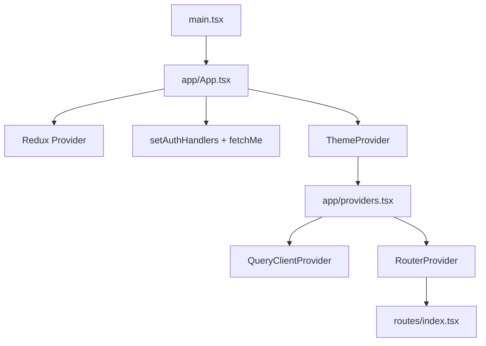

# HRIS FE Setup Guide — Plan

## Deliverable

Create [`HRIS+REACT+NODE/FE/SETUP_GUIDE.md`](HRIS+REACT+NODE/FE/SETUP_GUIDE.md) as a standalone step-by-step guide. Keep [`FE/README.md`](HRIS+REACT+NODE/FE/README.md) unchanged (quick start + scripts only).

The guide follows the user's 12-section template order but replaces generic examples with **real paths, patterns, and code from this repo**. Where the codebase differs from the template (Vitest not Jest, `modules/` not `features/`, `protectedRoute.tsx` not `protectedRoutes.tsx`), the guide states the actual convention explicitly so readers are not misled.

---

## Document structure (12 sections + intro/outro)

### Intro: Prerequisites and bootstrap flow

- **Stack:** React 19, TypeScript, Vite 8, Tailwind CSS 4, Redux Toolkit, TanStack Query v5, Axios, react-router-dom v7, shadcn/Radix (`radix-nova`), Sonner, optional Sentry.
- **Env:** copy `.env.example` → `.env`; `VITE_API_BASE_URL=http://localhost:3000`.
- **Entry chain** (mermaid):



- Reference [`src/main.tsx`](HRIS+REACT+NODE/FE/src/main.tsx), [`src/app/App.tsx`](HRIS+REACT+NODE/FE/src/app/App.tsx), [`src/app/providers.tsx`](HRIS+REACT+NODE/FE/src/app/providers.tsx).

---

### 1. Project Structure

Document the **actual** `src/` tree (not the template's hypothetical one):

```
src/
├── app/              # App shell, Redux re-export, global providers
├── assets/
├── components/       # Shared app components + layout/ + ui/ (shadcn)
├── constants/        # routes, endpoints, navigation, permissions, routeMeta
├── hooks/            # Typed Redux hooks, useEntityCrudPage, usePermission, useTheme
├── layouts/          # PublicLayout, AuthLayout, DashboardLayout
├── lib/              # queryClient, queryKeys, cn()
├── modules/          # Feature domains (30 modules) — NOT features/ or pages/
├── queries/          # TanStack Query hooks (factory + per-domain)
├── routes/           # index.tsx, lazyRoutes.tsx, protectedRoute.tsx
├── services/         # httpClient, errors, logger + api/*
├── slices/           # authSlice, uiSlice
├── store/            # configureStore + rootReducer
├── test/             # setup, utils, fixtures, unit/, integration/
├── types/
├── ui/               # Design-system barrel (re-exports shadcn + thin wrappers)
└── utils/
```

**Decide upfront** (call out as bullet list):
- Module-based architecture under `modules/` (enforced by `eslint-plugin-boundaries`)
- Redux for **session + UI only** (`auth`, `ui`); server data in TanStack Query
- Query hooks live in `queries/`, not inside modules
- API layer in `services/api/`, not top-level `api/`
- `@/*` path alias via Vite + `tsconfig.app.json`
- Named exports from pages (required for lazy loading pattern)

---

### 2. Layouts and Components Layout

**Layouts** ([`src/layouts/`](HRIS+REACT+NODE/FE/src/layouts/)):

| Layout | Used for | Behavior |
|--------|----------|----------|
| `PublicLayout` | `/`, `/about`, `/pricing`, `/contact` | `PublicNavbar` + `<Outlet>`; redirects authed users to dashboard |
| `AuthLayout` | `/auth/*` | Centered card shell; redirects authed users |
| `DashboardLayout` | All protected routes | `AppSidebar`, `AppHeader`, `AppFooter`, `PageShell` area |

Include real skeleton from [`AuthLayout.tsx`](HRIS+REACT+NODE/FE/src/layouts/AuthLayout.tsx) (header with logo link, centered card, footer).

**Layout components** ([`src/components/layout/`](HRIS+REACT+NODE/FE/src/components/layout/)):
- `AppBreadcrumbs`, `AppFooter`, `AppHeader`, `AppSidebar`
- `GlobalSearch`, `MessageInbox`, `NotificationBell`
- `PageShell`, `PublicNavbar`, `DataTableToolbar`

Note: import shadcn primitives from `@/components/ui/*` or the `@/ui` barrel depending on convention in each file.

---

### 3. Routing FE

**Already installed:** `react-router-dom` v7 (not a setup step — document as existing).

**File skeleton:**

```
routes/
├── index.tsx           # createBrowserRouter
├── lazyRoutes.tsx      # React.lazy() per page
└── protectedRoute.tsx  # Auth guard (singular filename)
constants/
└── routes.ts           # ROUTES object
```

**Key patterns to document with real snippets:**

1. **`ROUTES`** — from [`constants/routes.ts`](HRIS+REACT+NODE/FE/src/constants/routes.ts); always use constants, never hardcode paths.

2. **Lazy loading** — from [`lazyRoutes.tsx`](HRIS+REACT+NODE/FE/src/routes/lazyRoutes.tsx):
   - Pages use **named exports** (`export function UsersListPage`)
   - Lazy import: `.then((m) => ({ default: m.UsersListPage }))`

3. **`PageLoader` + `Skeleton`** — from [`components/PageLoader.tsx`](HRIS+REACT+NODE/FE/src/components/PageLoader.tsx) and [`components/ui/skeleton.tsx`](HRIS+REACT+NODE/FE/src/components/ui/skeleton.tsx).

4. **Router structure** — from [`routes/index.tsx`](HRIS+REACT+NODE/FE/src/routes/index.tsx):
   - Three layout groups: Public → Auth (`/auth`) → Protected (`ProtectedRoute` → `DashboardLayout`)
   - `SuspenseWrap` with `<PageLoader />` fallback (not empty string)
   - Legacy redirect: `/login` → `/auth/login`
   - Catch-all `*` → landing

5. **Adding a new route** — numbered checklist:
   - Add path to `constants/routes.ts`
   - Add lazy export in `lazyRoutes.tsx`
   - Register route in `routes/index.tsx` under correct layout
   - Add nav entry in `constants/navigation.ts` (dashboard) or `publicNavigation.ts` (public)
   - Add `routeMeta.ts` entry if breadcrumbs/title needed

**Honest gap callout:** `ROUTES.resetPassword` exists but there is **no** `ResetPasswordPage` or router entry yet.

---

### 4. Authentication Foundation

Document the real flow across these files:

| Concern | File |
|---------|------|
| Session state | [`slices/authSlice.ts`](HRIS+REACT+NODE/FE/src/slices/authSlice.ts) — `login`, `logout`, `fetchMe`, `refreshSession` |
| Auth API | [`services/api/authApi.ts`](HRIS+REACT+NODE/FE/src/services/api/authApi.ts) |
| Token storage | [`services/httpClient.ts`](HRIS+REACT+NODE/FE/src/services/httpClient.ts) — `sessionStorage` keys: `hris_access_token`, `hris_refresh_token`, `hris_tenant_id` |
| Interceptors | Same file — Bearer + `X-Tenant-Id` on request; queue-based 401 refresh |
| Handler wiring | [`app/App.tsx`](HRIS+REACT+NODE/FE/src/app/App.tsx) — `setAuthHandlers` + bootstrap `fetchMe` |
| Route guard | [`routes/protectedRoute.tsx`](HRIS+REACT+NODE/FE/src/routes/protectedRoute.tsx) |

**Flows to describe:**
- Login: `LoginPage` → Redux `login` thunk → tokens stored → navigate dashboard
- Logout: `AppHeader` → `logout` thunk → clear storage
- Bootstrap: on mount, if token exists → `fetchMe`
- 401: interceptor calls `refreshSession`; on failure → `clearAuthStorage`

**Honest gap:** `ProtectedRoute` accepts optional `permissions` prop and uses `usePermission`, but **no routes pass permissions today**. Document how to wire it when needed.

---

### 5. Reusable UI Components

Two layers — explain clearly to avoid confusion:

1. **`components/ui/`** — shadcn/Radix primitives (27 files): `button`, `input`, `form`, `dialog`, `table`, `dropdown-menu`, etc. Config in [`components.json`](HRIS+REACT+NODE/FE/components.json).
2. **`ui/`** — convenience barrel ([`ui/index.ts`](HRIS+REACT+NODE/FE/src/ui/index.ts)) re-exporting common primitives + thin wrappers (`Modal`, `Select`, `Dropdown`).

**Shared app components** (used across features):
- `EntityListPage`, `EntityFormDialog`, `ConfirmDialog` — generic CRUD UI
- `PageHeader`, `PageLoader`, `EmptyState`, `ErrorBoundary`, `StatusBadge`
- `MetricsDashboard`, `OrgChartTree`, `EmployeeActionDialog` — domain-specific shared

**Principle:** Radix = behavior; Tailwind = styling; project conventions = final authority (same as template).

---

### 6. Vitest + React Testing Library (not Jest)

**Accurate naming:** This repo uses **Vitest** with Jest-compatible `describe`/`it`/`expect` API — do not label it Jest.

**Structure:**

```
test/
├── setup.ts              # jest-dom, matchMedia mock
├── utils.tsx             # renderWithProviders (Redux + Query + Router + Theme)
├── fixtures.ts           # mockAdminUser
├── features.ts           # integration coverage manifest
├── unit/                 # layout tests, slice tests
└── integration/          # live API tests (separate vitest config)
```

**Config:** [`vitest.config.ts`](HRIS+REACT+NODE/FE/vitest.config.ts) — jsdom, globals, `@` alias, excludes integration.

**Scripts:** `npm run test`, `test:watch`, `test:coverage`, `test:integration`, `test:all`.

**What to test first:** `uiSlice`, layout components, `LoginPage` + schemas, `factory.ts`, `errors.ts`.

**Core idea:** Test logic + UI in isolation via `renderWithProviders`, not full app flows (those are integration/E2E).

---

### 7. Global UI State

[`slices/uiSlice.ts`](HRIS+REACT+NODE/FE/src/slices/uiSlice.ts) — Redux for UI only:

- `sidebarOpen`, `theme`, `globalLoading`
- `expandedNavGroups`, `notificationsOpen`, `commandPaletteOpen`, `sidebarSearchQuery`

Theme sync via [`hooks/useTheme.ts`](HRIS+REACT+NODE/FE/src/hooks/useTheme.ts) + [`components/ThemeProvider.tsx`](HRIS+REACT+NODE/FE/src/components/ThemeProvider.tsx).

**No feature slices** — business/server state belongs in TanStack Query.

---

### 8. API Layer

**HTTP client:** [`services/httpClient.ts`](HRIS+REACT+NODE/FE/src/services/httpClient.ts)
- Base URL: `${VITE_API_BASE_URL}/api/v1` (see [`constants/api.ts`](HRIS+REACT+NODE/FE/src/constants/api.ts))

**API factory:** [`services/api/client.ts`](HRIS+REACT+NODE/FE/src/services/api/client.ts)
- `apiGet`, `apiPost`, etc. — unwrap `ApiResponse<T>.data`
- `createResourceApi` — read-only CRUD
- `createMutableResourceApi` — adds soft delete, restore, trashed list

**Per-domain APIs:** `services/api/<domain>Api.ts` + paths in [`constants/endpoints.ts`](HRIS+REACT+NODE/FE/src/constants/endpoints.ts)

**Error normalization:** [`services/errors.ts`](HRIS+REACT+NODE/FE/src/services/errors.ts)

---

### 9. TanStack Query Setup

| File | Role |
|------|------|
| [`lib/queryClient.ts`](HRIS+REACT+NODE/FE/src/lib/queryClient.ts) | Singleton; global toast on query/mutation errors |
| [`lib/queryKeys.ts`](HRIS+REACT+NODE/FE/src/lib/queryKeys.ts) | Hierarchical keys per resource |
| [`queries/factory.ts`](HRIS+REACT+NODE/FE/src/queries/factory.ts) | `createResourceQueryHooks()` → list/trashed/CRUD mutations |
| [`queries/<domain>/queries.ts`](HRIS+REACT+NODE/FE/src/queries/users/queries.ts) | Wires factory to API + keys |
| [`queries/index.ts`](HRIS+REACT+NODE/FE/src/queries/index.ts) | Barrel re-exports |

**Convention:** Query hooks live in `queries/`, modules re-export via `modules/<domain>/hooks.ts`.

Example from users module:

```ts
// queries/users/queries.ts
const hooks = createResourceQueryHooks(queryKeys.users, usersApi)
export const useUsersList = hooks.useList
// ...

// modules/users/hooks.ts
export { useUsersList, ... } from '@/queries/users/queries'
```

---

### 10. Feature Module Structure

**Standard module** (most HR domains):

```
modules/<domain>/
├── pages/ListPage.tsx    # Named export: <Domain>ListPage
├── hooks.ts              # Re-exports from @/queries/<domain>
└── types.ts              # Domain types
```

**Generic CRUD page pattern** — document full chain using [`modules/users/pages/ListPage.tsx`](HRIS+REACT+NODE/FE/src/modules/users/pages/ListPage.tsx) + [`hooks/useEntityCrudPage.ts`](HRIS+REACT+NODE/FE/src/hooks/useEntityCrudPage.ts):
- `useEntityCrudPage` wires list/form/confirm dialogs
- `EntityListPage` renders searchable table with soft-delete tabs
- `EntityFormDialog` uses local state (name + status only)

**"Add a new HR module" checklist** (most important repeatable section):
1. Create `services/api/<domain>Api.ts` (usually `createMutableResourceApi`)
2. Add endpoints to `constants/endpoints.ts`
3. Add query keys to `lib/queryKeys.ts`
4. Create `queries/<domain>/queries.ts` via factory
5. Re-export in `queries/index.ts`
6. Create `modules/<domain>/` with `pages/ListPage.tsx`, `hooks.ts`, `types.ts`
7. Add lazy route + `ROUTES` constant + nav + routeMeta
8. Add to `test/features.ts` and `cypress/e2e/features.cy.ts` if testing coverage matters

**Exceptions to document** (not generic CRUD):
- `auth` — login/register/forgot with RHF + zod
- `public` — marketing pages
- `dashboard` — metrics via analytics query
- `leave`, `employees`, `organization`, `reports`, `permissions` — custom UI

**ESLint boundary rule:** modules must not import from other modules (only shared layers).

---

### 11. E2E Testing (Cypress)

**Structure:**

```
cypress/
├── e2e/
│   ├── auth.cy.ts
│   ├── navigation.cy.ts
│   └── features.cy.ts
├── fixtures/
│   └── auth.json, dashboard.json
└── support/
    ├── commands.ts
    └── e2e.ts
```

**Config:** [`cypress.config.ts`](HRIS+REACT+NODE/FE/cypress.config.ts) — base URL `http://localhost:5173`.

**Scripts:** `cy:open`, `cy:run`, `test:e2e` (starts dev server via `start-server-and-test`).

**Core idea:** Behave like real users; default suite can run without backend (mocked API per README).

---

### 12. Forms + Validation

**Auth forms** — full RHF + zod pattern:
- Schemas: [`modules/auth/schemas.ts`](HRIS+REACT+NODE/FE/src/modules/auth/schemas.ts)
- UI: shadcn `Form` from `components/ui/form.tsx`
- Pages: `LoginPage` (Redux), `RegisterPage` / `ForgotPasswordPage` (direct API)

**Entity CRUD forms** — **different pattern:**
- `EntityFormDialog` uses `useState`, not RHF/zod
- Only `name` + `status` fields — sufficient for scaffold, not for production domain forms

**When extending:** add zod schemas per module when moving beyond generic CRUD.

---

### Recommended order + known gaps

End with the recommended build order (same as template, adjusted):

1. Folder structure → 2. Layouts → 3. Routing → 4. Auth → 5. UI components → 6. Vitest → 7. UI slice → 8. API layer → 9. TanStack Query → 10. Feature modules → 11. Cypress → 12. Forms

**"Do not mislead" summary box:**
- Vitest, not Jest
- `modules/`, not `features/`
- Most list pages are API-wired but UI-generic (name/status)
- Reset password route constant exists; page/route not implemented
- Route-level permissions supported but not wired in router
- Register does not auto-login (redirects to login)
- Backend required for integration tests; E2E can use mocks

---

## Writing style

- Match the user's template tone: numbered sections, folder trees, short code snippets from real files (trimmed where long).
- Use markdown links to actual file paths.
- Include one mermaid diagram for bootstrap flow and optionally one for the data layer (`API → queries → module hooks → page`).
- No emojis; complete sentences; actionable checklists for repetitive tasks (new route, new module).
