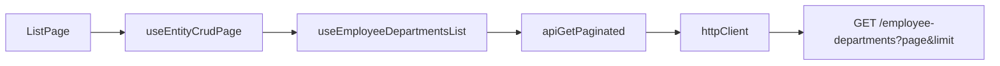

# Employee Department Feature — Complete Step-by-Step Guide

This document explains **exactly** how the **Employee Department** feature was built in this HRIS project. Follow it top to bottom to recreate the feature or clone the pattern for a new module.

For login, cookie auth, CSRF, and API troubleshooting, see [authentication-walkthrough.mdc](authentication-walkthrough.mdc).

---

## 1. Feature overview

**What it does:** Shows a CRUD table of employees with an extra **Department** column. Each row is an employee record linked to a department via `Employee.departmentId`.

**What it is NOT:** There is no separate `EmployeeDepartment` database table. The backend module reads/writes the existing `Employee` model and includes the related `Department` name in API responses.

**UI location:** Sidebar → **People & Organization** → **Employee Department** → route `/employee-departments`

**Table columns:** Name | Department | Status | Actions

**Features (same as other CRUD modules):**
- List active records (paginated, default 20 per page)
- Toggle “Show deleted” (trashed view)
- Search by name, status, or department name
- Status filter
- Create / Edit (with department dropdown)
- Soft delete / Restore / Hard delete

**Related modules (same tenant, different API surfaces):**

| Route | Purpose |
|-------|---------|
| `/employees` | Full employee CRUD + promote/transfer actions |
| `/departments` | Department master data CRUD |
| `/employee-departments` | Same underlying `Employee` rows, focused on department assignment (extra column + dropdown) |

---

## 2. Prerequisites

1. Node.js installed
2. PostgreSQL running with env configured in `BE/.env`
3. Backend running: `cd BE && npm run start:dev`
4. Frontend running: `cd FE && npm run dev`
5. Seed credentials: `admin@hris.com` / `password`

**Frontend env** — `FE/.env`:

```env
# Leave empty so /api uses the Vite proxy (required for cookie auth + CSRF)
VITE_API_BASE_URL=
```

Do **not** set `VITE_API_BASE_URL=http://localhost:3000` for browser dev — cross-origin requests break CSRF. See [authentication-walkthrough.mdc](authentication-walkthrough.mdc) for 502/403/401 troubleshooting.

---

## 3. Data model (no new migration)

Employees already have a department FK in [BE/prisma/schema.prisma](BE/prisma/schema.prisma):

- `Employee.departmentId` → `Department.id`
- Seed creates **200 departments and 200 employees** (`SEED_COUNT = 200` in [BE/prisma/seed.ts](BE/prisma/seed.ts)), each employee assigned a department via `departmentId`
- Department names follow the pattern `Department 1` … `Department 200`

---

## 4. Backend — step by step

### Step 4.1 — Add the response DTO

**File:** [BE/src/common/mappers/list-entity.mapper.ts](BE/src/common/mappers/list-entity.mapper.ts)

Add an interface that extends the standard list shape:

```typescript
export interface EmployeeDepartmentDto extends ListEntityDto {
  departmentId: string | null;
  departmentName: string;
}
```

**Why:** Standard `ListEntityDto` only has `name` and `status`. This feature needs department fields in the JSON response.

---

### Step 4.2 — Add the mapper function

**File:** [BE/src/common/mappers/domain.mappers.ts](BE/src/common/mappers/domain.mappers.ts)

Add `mapEmployeeDepartment()` that:
1. Builds the base list DTO from employee first/last name and status
2. Adds `departmentId` and `departmentName` from the included `department` relation

**Why:** Every list/detail endpoint returns data through mappers, not raw Prisma rows.

---

### Step 4.3 — Create the service

**File:** [BE/src/modules/employee-departments/employee-departments.service.ts](BE/src/modules/employee-departments/employee-departments.service.ts)

Create `EmployeeDepartmentsService` that uses `this.prisma.employee` with:

```typescript
include: { department: true }
```

Implement these methods (copy pattern from [BE/src/modules/benefits/benefits.service.ts](BE/src/modules/benefits/benefits.service.ts)):

| Method | What it does |
|--------|----------------|
| `list` | Active employees with department |
| `listTrashed` | Soft-deleted employees with department |
| `get` | Single employee with department |
| `create` | Parse `name`, accept `departmentId` and `status` |
| `update` | Update name, status, `departmentId` |
| `softDelete` | Set `deletedAt`, status inactive |
| `restore` | Clear `deletedAt`, status active |
| `remove` | Hard delete |

**Why:** Dedicated API surface for this feature without changing the existing `/employees` module behavior.

**Note:** Request bodies use inline typing in the service — there are no `class-validator` DTOs for this module.

---

### Step 4.4 — Create the controller

**File:** [BE/src/modules/employee-departments/employee-departments.controller.ts](BE/src/modules/employee-departments/employee-departments.controller.ts)

```typescript
@Controller('employee-departments')
@Permissions('employee-departments:read')
```

Routes:

| Method | Path | Permission |
|--------|------|------------|
| GET | `/employee-departments` | read |
| GET | `/employee-departments/trashed` | read |
| GET | `/employee-departments/:id` | read |
| POST | `/employee-departments` | write |
| PUT/PATCH | `/employee-departments/:id` | write |
| PATCH | `/employee-departments/:id/soft-delete` | write |
| PATCH | `/employee-departments/:id/restore` | write |
| DELETE | `/employee-departments/:id` | write |

Full URL prefix: `http://localhost:3000/api/v1/employee-departments`

---

### Step 4.5 — Create the module

**File:** [BE/src/modules/employee-departments/employee-departments.module.ts](BE/src/modules/employee-departments/employee-departments.module.ts)

Register controller + service.

---

### Step 4.6 — Register in app module

**File:** [BE/src/app.module.ts](BE/src/app.module.ts)

Import and add `EmployeeDepartmentsModule` to the `imports` array (next to `EmployeesModule`).

---

### Step 4.7 — Add permissions to seed

**File:** [BE/prisma/seed.ts](BE/prisma/seed.ts)

Add to the `PERMISSIONS` array:

```typescript
'employee-departments:read',
'employee-departments:write',
```

The admin role loop already assigns all permissions — no extra role wiring needed.

Employee seed data already sets `departmentId` on each employee — **no new seed rows required**.

---

### Step 4.8 — Run the seeder

```bash
cd BE
npm run prisma:seed
```

Expected output includes `departments: 200, employees: 200` (from `SEED_COUNT = 200`).

---

### Step 4.9 — Verify backend

The API uses **HttpOnly cookie auth + CSRF**, not Bearer tokens. Use a cookie jar (PowerShell example):

```powershell
# 1. CSRF token + cookie
$csrf = curl.exe -s -c "$env:TEMP\hris-jar.txt" "http://localhost:3000/api/v1/auth/csrf" | ConvertFrom-Json
$token = $csrf.data.csrfToken

# 2. Login (sets session cookies)
curl.exe -s -b "$env:TEMP\hris-jar.txt" -c "$env:TEMP\hris-jar.txt" `
  -H "Content-Type: application/json" -H "X-CSRF-Token: $token" `
  -d '{"email":"admin@hris.com","password":"password"}' `
  "http://localhost:3000/api/v1/auth/login"

# 3. List employee-departments (use tenantId from login response)
curl.exe -s -b "$env:TEMP\hris-jar.txt" `
  -H "X-Tenant-Id: <tenantId-from-login-user>" `
  "http://localhost:3000/api/v1/employee-departments?page=1&limit=5"
```

For browser-equivalent testing, use the Vite proxy: `http://localhost:5173/api/v1/...` (requires FE dev server running).

Expected: paginated response with `data[]` items, each including `departmentName` like `"Department 1"`. Total active records: **200** after seed.

---

## 5. Frontend — shared component changes

### Step 5.1 — Add extra columns to EntityListPage

**File:** [FE/src/components/EntityListPage.tsx](FE/src/components/EntityListPage.tsx)

Add prop:

```typescript
extraColumns?: { header: string; cell: (item: EntityListItem) => React.ReactNode }[]
```

Render extra column headers/cells **between Name and Status**.

Change `searchKeys` type to `string[]` so you can search `departmentName`.

**Why:** The default table only shows Name + Status. This feature needs a Department column without rewriting the whole page.

---

### Step 5.2 — Prefill extra form fields on edit

**File:** [FE/src/hooks/useEntityCrudPage.ts](FE/src/hooks/useEntityCrudPage.ts)

When building `initialValues` for edit mode, spread values from `formFields` keys (e.g. `departmentId`) off `editingItem`.

**Why:** Edit dialog must pre-select the current department in the dropdown.

---

### Step 5.3 — Add department select form field helper

**File:** [FE/src/constants/formFields.ts](FE/src/constants/formFields.ts)

```typescript
export const departmentSelectField = (options: SelectOption[]): FormFieldConfig => ({
  key: 'departmentId',
  label: 'Department',
  type: 'select',
  options,
})
```

---

## 6. Frontend — module files

Create these new files:

### Step 6.1 — Types

**File:** [FE/src/modules/employeeDepartments/types.ts](FE/src/modules/employeeDepartments/types.ts)

```typescript
export interface EmployeeDepartmentsEntity extends BaseEntity {
  name: string
  status: string
  departmentId: string | null
  departmentName: string
}
```

---

### Step 6.2 — API client

**File:** [FE/src/services/api/employeeDepartmentsApi.ts](FE/src/services/api/employeeDepartmentsApi.ts)

Use `createMutableResourceApi` with endpoints from `endpoints.employeeDepartments`. List calls use **`apiGetPaginated`** (not flat `apiGet`).

---

### Step 6.3 — Query keys

**File:** [FE/src/lib/queryKeys.ts](FE/src/lib/queryKeys.ts)

```typescript
employeeDepartments: {
  all: ['employeeDepartments'] as const,
  list: () => [...queryKeys.employeeDepartments.all, 'list'] as const,
  trashed: () => [...queryKeys.employeeDepartments.all, 'trashed'] as const,
},
```

---

### Step 6.4 — Endpoints

**File:** [FE/src/constants/endpoints.ts](FE/src/constants/endpoints.ts)

```typescript
employeeDepartments: {
  list: '/employee-departments',
  byId: id('/employee-departments'),
  ...lifecycle('/employee-departments'),
},
```

---

### Step 6.5 — React Query hooks

**File:** [FE/src/queries/employeeDepartments/queries.ts](FE/src/queries/employeeDepartments/queries.ts)

```typescript
const hooks = createResourceQueryHooks(queryKeys.employeeDepartments, employeeDepartmentsApi)
export const useEmployeeDepartmentsList = hooks.useList
// ... trashed, create, update, softDelete, restore, remove
```

Export from [FE/src/queries/index.ts](FE/src/queries/index.ts).

---

### Step 6.6 — Module hooks barrel

**File:** [FE/src/modules/employeeDepartments/hooks.ts](FE/src/modules/employeeDepartments/hooks.ts)

Re-export hooks from `@/queries`.

---

### Step 6.7 — List page

**File:** [FE/src/modules/employeeDepartments/pages/ListPage.tsx](FE/src/modules/employeeDepartments/pages/ListPage.tsx)

Pattern:
1. Load departments with `useDepartmentsList({ page: 1, limit: 100 })` for dropdown options (caps at 100 departments)
2. Map departments to `{ value: id, label: name }` options
3. Call `useEntityCrudPage` with employee-departments hooks
4. Pass `formFields: [departmentSelectField(departmentOptions)]`
5. Pass `extraColumns` for Department column — reads `departmentName` via type cast (current pattern):

```typescript
extraColumns={[
  {
    header: 'Department',
    cell: (item) =>
      String((item as unknown as Record<string, unknown>).departmentName ?? '—'),
  },
]}
```

6. Pass `searchKeys={['name', 'status', 'departmentName']}`
7. Render `EntityListPage`, `EntityFormDialog`, `ConfirmDialog`

Use [FE/src/modules/departments/pages/ListPage.tsx](FE/src/modules/departments/pages/ListPage.tsx) as the CRUD template.

---

## 7. Frontend — wiring (constants & routes)

### Step 7.1 — Route constant

**File:** [FE/src/constants/routes.ts](FE/src/constants/routes.ts)

```typescript
employeeDepartments: '/employee-departments',
```

---

### Step 7.2 — Permissions

**File:** [FE/src/constants/permissions.ts](FE/src/constants/permissions.ts)

```typescript
employeeDepartmentsRead: 'employee-departments:read',
employeeDepartmentsWrite: 'employee-departments:write',
```

---

### Step 7.3 — Sidebar navigation

**File:** [FE/src/constants/navigation.ts](FE/src/constants/navigation.ts)

Under **People & Organization**, after Employees:

```typescript
{ label: 'Employee Department', path: ROUTES.employeeDepartments, icon: GitBranch, permission: PERMISSIONS.employeeDepartmentsRead },
```

---

### Step 7.4 — Route meta (title & breadcrumbs)

**File:** [FE/src/constants/routeMeta.ts](FE/src/constants/routeMeta.ts)

Add entry for `ROUTES.employeeDepartments`.

---

### Step 7.5 — Lazy route

**File:** [FE/src/routes/lazyRoutes.tsx](FE/src/routes/lazyRoutes.tsx)

```typescript
export const EmployeeDepartmentsListPage = lazy(() =>
  import('@/modules/employeeDepartments/pages/ListPage').then((m) => ({
    default: m.EmployeeDepartmentsListPage,
  })),
)
```

---

### Step 7.6 — Router entry

**File:** [FE/src/routes/index.tsx](FE/src/routes/index.tsx)

```typescript
{ path: 'employee-departments', element: <SuspenseWrap><Lazy.EmployeeDepartmentsListPage /></SuspenseWrap> },
```

---

### Step 7.7 — E2E feature registry (optional)

**File:** [FE/src/test/features.ts](FE/src/test/features.ts)

Add a `FEATURE_PAGES` entry for `/employee-departments`.

---

## 8. Request flow (how data loads)

When you open `/employee-departments`:

1. Navigate to `/employee-departments` in [FE/src/routes/index.tsx](FE/src/routes/index.tsx)
2. Lazy-loads page from [FE/src/routes/lazyRoutes.tsx](FE/src/routes/lazyRoutes.tsx)
3. Page mounts in [FE/src/modules/employeeDepartments/pages/ListPage.tsx](FE/src/modules/employeeDepartments/pages/ListPage.tsx)
4. `useDepartmentsList({ page: 1, limit: 100 })` loads dropdown options in parallel
5. `useEntityCrudPage` calls `useEmployeeDepartmentsList({ page, limit })` with default **limit 20** in [FE/src/hooks/useEntityCrudPage.ts](FE/src/hooks/useEntityCrudPage.ts)
6. Hook defined in [FE/src/queries/employeeDepartments/queries.ts](FE/src/queries/employeeDepartments/queries.ts)
7. React Query runs `employeeDepartmentsApi.list(params)` via [FE/src/queries/factory.ts](FE/src/queries/factory.ts)
8. API client in [FE/src/services/api/employeeDepartmentsApi.ts](FE/src/services/api/employeeDepartmentsApi.ts) uses `createMutableResourceApi`
9. `createMutableResourceApi.list` calls **`apiGetPaginated`** in [FE/src/services/api/client.ts](FE/src/services/api/client.ts)
10. `apiGetPaginated` → `httpClient.get` with query params (`page`, `limit`, `q`, `status`)
11. Axios instance in [FE/src/services/httpClient.ts](FE/src/services/httpClient.ts) sends cookies automatically (`withCredentials: true`)
12. Backend [BE/src/modules/employee-departments/employee-departments.controller.ts](BE/src/modules/employee-departments/employee-departments.controller.ts) → service → Prisma
13. Response shape: `{ data: EmployeeDepartmentDto[], meta: { total, page, limit } }`
14. [FE/src/components/EntityListPage.tsx](FE/src/components/EntityListPage.tsx) renders paginated rows with Department column

**Mutating requests (create / edit / delete):**

- `httpClient` request interceptor attaches `X-CSRF-Token` on POST/PUT/PATCH/DELETE
- Session cookies sent automatically; no `Authorization: Bearer` header



---

## 9. Verification checklist

- [ ] Login works at `http://localhost:5173/auth/login` (`admin@hris.com` / `password`)
- [ ] Sidebar shows **Employee Department** under People & Organization
- [ ] `/employee-departments` loads without errors
- [ ] Table shows paginated rows (default **20 per page**; **200 total** after seed) with Name, Department, Status
- [ ] Search for `"Department 3"` filters correctly
- [ ] **Add** creates a new employee with selected department (no **403 Invalid CSRF token**)
- [ ] **Edit** changes department assignment
- [ ] **Soft delete** moves row to trash view
- [ ] **Restore** brings row back
- [ ] **Hard delete** permanently removes row
- [ ] API `GET /api/v1/employee-departments?page=1&limit=5` returns `departmentName` on each item (cookie session, not Bearer)

---

## 10. Clone checklist for your next feature

Use this template when adding any new CRUD module:

### Backend
- [ ] DTO + mapper (if extra fields beyond name/status)
- [ ] `modules/<name>/<name>.service.ts`
- [ ] `modules/<name>/<name>.controller.ts`
- [ ] `modules/<name>/<name>.module.ts`
- [ ] Register in `app.module.ts`
- [ ] Add permissions to `prisma/seed.ts`
- [ ] Run `npm run prisma:seed`
- [ ] Test protected endpoint with **cookie session** (not Bearer)

### Frontend
- [ ] `VITE_API_BASE_URL=` in `FE/.env` for browser dev
- [ ] `modules/<name>/types.ts`
- [ ] `services/api/<name>Api.ts`
- [ ] `queries/<name>/queries.ts` + export in `queries/index.ts`
- [ ] `modules/<name>/hooks.ts`
- [ ] `modules/<name>/pages/ListPage.tsx`
- [ ] `constants/routes.ts`
- [ ] `constants/endpoints.ts`
- [ ] `constants/permissions.ts`
- [ ] `lib/queryKeys.ts`
- [ ] `constants/navigation.ts`
- [ ] `constants/routeMeta.ts`
- [ ] `routes/lazyRoutes.tsx`
- [ ] `routes/index.tsx`

### If you need extra table columns
- [ ] Extend `EntityListPage` with `extraColumns` prop
- [ ] Extend `useEntityCrudPage` to prefill extra form fields on edit

---

## 11. Files created or modified (reference)

### Backend — new
- `BE/src/modules/employee-departments/employee-departments.module.ts`
- `BE/src/modules/employee-departments/employee-departments.controller.ts`
- `BE/src/modules/employee-departments/employee-departments.service.ts`

### Backend — modified
- `BE/src/common/mappers/list-entity.mapper.ts`
- `BE/src/common/mappers/domain.mappers.ts`
- `BE/src/app.module.ts`
- `BE/prisma/seed.ts`

### Frontend — new
- `FE/src/modules/employeeDepartments/types.ts`
- `FE/src/modules/employeeDepartments/hooks.ts`
- `FE/src/modules/employeeDepartments/pages/ListPage.tsx`
- `FE/src/queries/employeeDepartments/queries.ts`
- `FE/src/services/api/employeeDepartmentsApi.ts`

### Frontend — modified
- `FE/src/components/EntityListPage.tsx`
- `FE/src/hooks/useEntityCrudPage.ts`
- `FE/src/constants/formFields.ts`
- `FE/src/constants/routes.ts`
- `FE/src/constants/endpoints.ts`
- `FE/src/constants/permissions.ts`
- `FE/src/constants/navigation.ts`
- `FE/src/constants/routeMeta.ts`
- `FE/src/lib/queryKeys.ts`
- `FE/src/routes/lazyRoutes.tsx`
- `FE/src/routes/index.tsx`
- `FE/src/queries/index.ts`
- `FE/src/test/features.ts`

### Companion docs
- [authentication-walkthrough.mdc](authentication-walkthrough.mdc) — HttpOnly cookie auth, CSRF, env setup, troubleshooting
