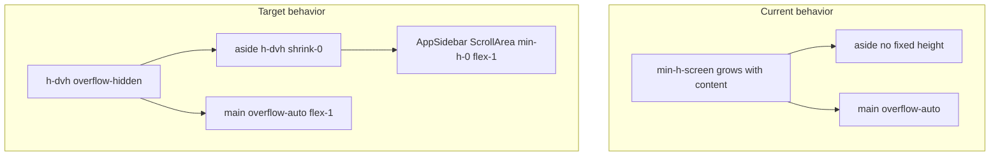
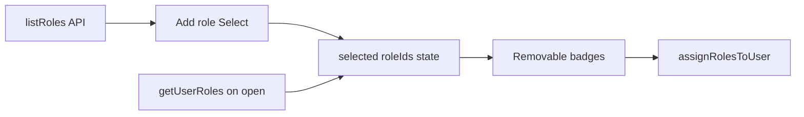

# Sidebar viewport scroll + user role dropdown

## 1. AppSidebar: full viewport height + independent scrollbar

**Problem today:** [`DashboardLayout.tsx`](FE/src/layouts/DashboardLayout.tsx) uses `min-h-screen` on the outer flex container, and the `<aside>` has no explicit height. [`AppSidebar.tsx`](FE/src/components/layout/AppSidebar.tsx) uses `h-full` + `ScrollArea`, but without a constrained parent height the sidebar grows with page content and scrolls with the main area instead of independently.



**Changes in [`DashboardLayout.tsx`](FE/src/layouts/DashboardLayout.tsx):**
- Root: `flex min-h-screen` → `flex h-dvh overflow-hidden`
- `<aside>`: add `h-dvh shrink-0 overflow-hidden` (keep existing width/collapse classes)
- Content column: add `min-h-0 overflow-hidden` so `main` is the only vertical scroll container on the right

**Changes in [`AppSidebar.tsx`](FE/src/components/layout/AppSidebar.tsx):**
- Root wrapper (both collapsed and expanded): ensure `h-full min-h-0 flex-col`
- `ScrollArea`: `className="min-h-0 flex-1"` (critical flex-child fix so Radix viewport gets a bounded height)
- Thin sidebar scrollbar via Tailwind on `ScrollArea`, without editing the shared primitive:

```tsx
<ScrollArea className="min-h-0 flex-1 [&_[data-slot=scroll-area-scrollbar]]:w-1.5 [&_[data-slot=scroll-area-thumb]]:bg-border/80">
```

**Mobile sheet ([`AppHeader.tsx`](FE/src/components/layout/AppHeader.tsx)):** `SheetContent` already uses `inset-y-0` / full height. Add `flex flex-col overflow-hidden` on `SheetContent` so the same `AppSidebar` `h-full` + `ScrollArea` pattern works in the drawer.

**Verify:** With many nav groups expanded, only the nav section scrolls inside the sidebar; the header/search/settings footer stay fixed; the main page content scrolls separately.

---

## 2. UserRolesDialog: multi-role dropdown (not checkboxes)

**Scope (per your answers):** Update only [`UserRolesDialog.tsx`](FE/src/components/UserRolesDialog.tsx). Keep multi-role assignment via existing `PATCH /users/:id/roles` (`assignRolesToUser`).

**Current UI:** Checkbox list populated from `listRoles()`.

**Target UI:**
- **Add role:** `Select` from [`@/ui`](FE/src/ui/Select.tsx) with options = roles not already in `selected`
  - Placeholder: e.g. "Add role..."
  - On pick: append role id to `selected`, clear the select value
- **Selected roles:** render as removable `Badge` chips (name + remove button), reusing [`Badge`](FE/src/components/ui/badge.tsx)
- **Empty states:** keep existing loading / no-roles messages
- **Save:** unchanged — `assignMutation.mutate(selected)`



**Remove:** `Checkbox` / checkbox loop / `toggleRole` helper.

**Edge cases:**
- When all roles are assigned, disable the Select or show "All roles assigned"
- Prevent duplicate adds (filter options by `!selected.includes(role.id)`)

No backend changes required — API already accepts `roleIds: string[]`.

---

## Files to touch

| File | Change |
|------|--------|
| [`FE/src/layouts/DashboardLayout.tsx`](FE/src/layouts/DashboardLayout.tsx) | Viewport-locked shell layout |
| [`FE/src/components/layout/AppSidebar.tsx`](FE/src/components/layout/AppSidebar.tsx) | `min-h-0` scroll region + thin scrollbar |
| [`FE/src/components/layout/AppHeader.tsx`](FE/src/components/layout/AppHeader.tsx) | Sheet flex/overflow for mobile sidebar |
| [`FE/src/components/UserRolesDialog.tsx`](FE/src/components/UserRolesDialog.tsx) | Select + badge multi-role UI |

## Manual test plan

1. Open dashboard on desktop with sidebar expanded; shrink viewport height — sidebar stays full height, nav scrolls inside sidebar, main content scrolls independently.
2. Collapse sidebar — icon rail still viewport-height with its own scroll if needed.
3. Open mobile menu sheet — sidebar scrolls inside drawer, not the page behind it.
4. Users → Roles button → add multiple roles via dropdown, remove via badge X, save — roles persist on reopen.
