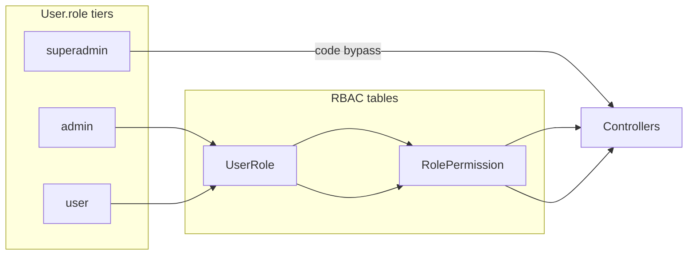

# Plan 1: Superadmin / Admin / User Role Model

## Target behavior

| Tier | `User.role` | BE authorization | FE `can()` | Default permissions |
|------|-------------|------------------|------------|---------------------|
| **superadmin** | `superadmin` | Code bypass only | Code bypass only | All codes returned in `/me` (for UI) |
| **admin** | `admin` | RBAC via `UserRole` → `RolePermission` | `user.permissions` only | All permissions seeded on `admin` Role; revocable by superadmin |
| **user** | `user` | RBAC only | `user.permissions` only | Empty until superadmin assigns `UserRole` rows |



**Role slug convention:** use `superadmin` everywhere (replace NestJS `super-admin`).

**Out of scope for this plan:** NestJS vs BE_JAVA runtime switching (FE talks to one backend); both backends updated for parity.

---

## Part A — BE_JAVA

### A1. Central permission resolver

Create [`BE_JAVA/src/main/java/com/hris/security/PermissionResolver.java`](BE_JAVA/src/main/java/com/hris/security/PermissionResolver.java):

- `resolve(User user)` → union of permission codes from `UserRole` → `RolePermission`
- If `user.role == "superadmin"` → return all codes (for API response only)
- **Remove** admin auto-grant (`permissionRepository.findAll()`)

Update [`AuthService.getPermissions()`](BE_JAVA/src/main/java/com/hris/auth/AuthService.java) to delegate to resolver.

### A2. Wire permissions into security context (critical bug fix)

[`JwtAuthenticationFilter`](BE_JAVA/src/main/java/com/hris/security/JwtAuthenticationFilter.java) currently passes `List.of()` permissions — RBAC is dead for non-admin users.

- Inject `PermissionResolver`
- Build `AuthenticatedUser` with resolved permission list on every request

### A3. Superadmin-only bypass

[`HrisPermissionEvaluator`](BE_JAVA/src/main/java/com/hris/security/HrisPermissionEvaluator.java):

```java
// Before: "admin".equals(user.role()) return true
// After:  "superadmin".equals(user.role()) return true
```

### A4. Replace `ROLE_admin` in controllers (28 files)

Bulk-replace `@PreAuthorize` pattern:

```text
hasAuthority('ROLE_admin') or hasPermission(...)
→ hasAuthority('ROLE_superadmin') or hasPermission(...)
```

Or drop role authority and rely on evaluator + loaded permissions (superadmin bypass remains in evaluator).

### A5. Implement RBAC stubs

[`RoleService`](BE_JAVA/src/main/java/com/hris/service/RoleService.java):

- `rolePermissions()` → return permission IDs/codes for role
- `setPermissions()` → replace `RolePermission` rows from `{ permissionIds: string[] }`

Add **user↔role assignment** in new `UserRoleService` or extend `UserService`:

- `GET /users/{id}/roles`
- `PATCH /users/{id}/roles` with `{ roleIds: string[] }`
- Guard: superadmin bypass OR `roles:manage` permission
- Prevent non-superadmin from assigning `superadmin` role

### A6. Seed data

Update [`V2__seed.sql`](BE_JAVA/src/main/resources/db/migration/V2__seed.sql) and [`generate.mjs`](BE_JAVA/scripts/generate.mjs):

| User | Email | `User.role` | `UserRole` |
|------|-------|-------------|------------|
| Superadmin | `superadmin@hris.com` | `superadmin` | none (bypass) |
| Admin | `admin@hris.com` | `admin` | → `admin` Role (all 43 `RolePermission` rows) |
| User 1–3 | `user1@hris.local` … | `user` | none |

Keep password `password` for dev.

---

## Part B — NestJS BE

Mirror BE_JAVA behavior in existing modules (NestJS RBAC is more complete today).

### B1. Permission resolution

[`auth.service.ts`](BE/src/modules/auth/auth.service.ts) `getUserPermissions()`:

- Remove `if (role === 'admin')` auto-grant-all
- Add `if (role === 'superadmin')` return all codes
- Otherwise: existing `userRoles` → `rolePermissions` chain only

Same change in [`jwt.strategy.ts`](BE/src/modules/auth/strategies/jwt.strategy.ts).

### B2. Guards

[`permissions.guard.ts`](BE/src/common/guards/permissions.guard.ts):

```ts
// Before: admin || super-admin bypass
// After:  superadmin bypass only
if (user.role === 'superadmin') return true;
```

[`tenant.guard.ts`](BE/src/common/guards/tenant.guard.ts): rename `super-admin` → `superadmin`.

### B3. User↔role assignment API

Add to [`users.controller.ts`](BE/src/modules/users/users.controller.ts) / `users.service.ts`:

- `GET /users/:id/roles`
- `PATCH /users/:id/roles` `{ roleIds: string[] }`
- `@Permissions('roles:manage')` + superadmin bypass via guard

### B4. Seed

Update [`BE/prisma/seed.ts`](BE/prisma/seed.ts):

- Add `superadmin@hris.com` with `role: 'superadmin'`
- Change seeded admin to `role: 'admin'` (keep full `RolePermission` on admin Role)
- Add 2–3 `userN@hris.local` with `role: 'user'`, no `UserRole`

---

## Part C — FE

### C1. Role constants

New [`FE/src/constants/roles.ts`](FE/src/constants/roles.ts):

```ts
export const ROLES = { superadmin: 'superadmin', admin: 'admin', user: 'user' } as const
export function isSuperAdmin(role: string): boolean
```

Narrow [`User.role`](FE/src/types/index.ts) to union type.

### C2. Permission hook

[`usePermission.ts`](FE/src/hooks/usePermission.ts):

```ts
// Before: user.role === 'admin' return true
// After:  isSuperAdmin(user.role) return true
return permissions.includes(permission)
```

### C3. Role/permission management UI fixes

Existing UI is mostly ready; wire missing pieces:

| File | Change |
|------|--------|
| [`RolePermissionsDialog.tsx`](FE/src/components/RolePermissionsDialog.tsx) | On open, fetch `GET /roles/:id/permissions` and pre-check boxes (today `selected` resets to `[]`) |
| [`permissionsApi.ts`](FE/src/services/api/permissionsApi.ts) | Add `getRolePermissions(roleId)` |
| [`endpoints.ts`](FE/src/constants/endpoints.ts) | Ensure role-permissions GET path matches backend |

**User role assignment (minimal):**

- Add `usersApi.assignRoles(userId, roleIds)` + `getUserRoles(userId)`
- Extend [`UsersListPage`](FE/src/modules/users/pages/ListPage.tsx) or add `UserRolesDialog` (mirror `RolePermissionsDialog`) — superadmin-only action button per row
- Gate dialog with `isSuperAdmin(user.role)` or `can(PERMISSIONS.rolesManage)`

### C4. Tests & fixtures

[`test/fixtures.ts`](FE/src/test/fixtures.ts):

- `mockSuperAdminUser` — `role: 'superadmin'`, `permissions: []`
- `mockAdminUser` — `role: 'admin'`, `permissions: [subset]`
- `mockRegularUser` — `role: 'user'`, `permissions: []`

Update [`usePermission.test.tsx`](FE/src/hooks/usePermission.test.tsx) for three tiers.

Update integration helper login credentials docs for `superadmin@hris.com`.

### C5. Optional hardening (recommended, small)

- Gate sidebar Settings footer with `can(PERMISSIONS.settingsWrite)` in [`AppSidebar.tsx`](FE/src/components/layout/AppSidebar.tsx)
- No route-level changes required beyond existing `ProtectedRoute` — inherits new `can()` behavior

---

## Verification checklist

1. Login as `superadmin@hris.com` → all menus visible, all API calls succeed
2. Login as `admin@hris.com` → all menus visible initially; revoke `users:read` on admin Role → Users menu hidden + API 403
3. Login as `user1@hris.local` → minimal menus; superadmin assigns role with permissions → menus appear after re-login/`fetchMe`
4. Superadmin can open Roles → Permissions dialog, save, and see changes reflected for admin on next session
5. Superadmin can assign roles to user1 via Users dialog
